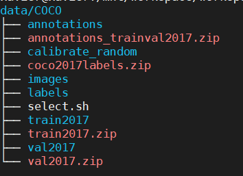

# Yolo(PyTorch) on Deepstream(Jetson)

### Introduction

This is  Pytorch TensorRT quantization sample for Yolo series(Now only test on yolov5s).  PTQ, partial quantization will be supported step by step, and deploy yolov5s TensorRT engine model on deepstream6.0. Now test platform is Jetson.


**NOTE** :  This repo is based on the release version(v5.0) of [yolov5](https://github.com/ultralytics/yolov5/).

<div align="center"></div>

 
### Future updates

* Partial quantization
* Dynamic Shape Support
* Sparse on Orin
* JetPack 5.0  

### Test platform

* Jetson Xavier AGX
* JetPack 4.6.1(Rel 32.7.1)
* Deepstream6.0
* l4t-ml docker 


### Code Structure


### Results of Quantization


#### Jetson platform

* [JetPack 4.6.1](https://developer.nvidia.com/jetpack-sdk-461)

 

##### YOLOv5s performance on Benchmarks(COCO)


| Method             | mAPval 0.5:0.95 |  mAPval 0.5   |  
|:------------------:| :-------------:|:------------:|  
| fp32        |   0.365        |   0.556      |  
| fp16        |   0.365        |   0.556      |  
| int8        |   0.344        |   0.538      |  

##### YOLOv5s inference performance (batch = 1, input size 640 *640,Xavier AGX)
Set Jetson maxium power model
```
 sudo nvpmodel -m0
 sudo jetson_clocks

#test in docker, test DIR is Yolo_on_Jetson/quantization
 /usr/src/tensorrt/bin/trtexec --loadEngine=weights/yolov5s_fp32.engine
 /usr/src/tensorrt/bin/trtexec --loadEngine=weights/yolov5s_fp16.engine
 /usr/src/tensorrt/bin/trtexec --loadEngine=weights/yolov5s_int8.engine
  
```

| Method             | ms |  qps  |  
|:------------------:| :-------------:|:------------:|  
| fp32        |   17.3        |   56.5      |  
| fp16        |   7.4        |   126.5      |  
| int8        |   5.3        |   169.7      |  


### Basic usage

#### 1. Clone the  the repo

```
git clone https://github.com/beyondli/Yolo_on_Jetson.git
```

#### 2. Dataset Preparation
Download the labels and images of coco2017, and unzip to the same level directory as the current project. Please refer to [Yolov5 coco2017](https://www.freesion.com/article/15911342560/) Preparation for reference.

```
#create coco2017 store directory outside Yolo_on_Jetson
mkdir data/COCO
```


##### Select 1000 random images from COCO dataset to run calibration

copy select.py to COCO dataset,   
make dir calibrate_random



run select.sh, then 1000 random images will be selected from train2017 to calibrate_radom
```
sh select.sh
```


#### 3. Docker Build and Launch
It is recommended to use Docker Run these commands 

```
docker run --gpus all --name your-docker-name -it --net host  -v /your-local-
path:/docker-map-path  nvcr.io/nvidia/l4t-ml:r32.6.1-py3   /bin/bash
```
*pre-requisite installation command when you log in docker before run any python code*  


```
#cd outside Yolo_on_Jetson to install pytorch-quantization
python3 -m pip install --upgrade pip
git clone https://github.com/NVIDIA/TensorRT.git
cd tools/pytorch-quantization
python3 setup.py install

#added this export to ~/.bashrc
export LD_PRELOAD=/usr/lib/aarch64-linux-gnu/libgomp.so.1
source ~/.bashrc

pip3 install tqdm
pip3 install seaborn
pip3 install pycocotools

apt update
apt install python3-tk
```
#### 4. Download Yolov5s Pretrained Model 

```
cd quantization/weights
wget https://github.com/ultralytics/yolov5/releases/download/v5.0/yolov5s.pt
```

#### 5. Model transfer to TensorRT engine
**NOTE** : All TensorRT operation should be in docker

export.py exports a pytorch model to onnx format.

```
python3 models/export.py --weights  ./weights/yolov5s.pt --img 640 --batch 1 --device 0
```

onnx_to_trt.py aims to build a TensorRT engine from a onnx model file, and save to the weights folder.

Build a fp32 engine.
```
python3 trt/onnx_to_trt.py --model ./weights/yolov5s.onnx --dtype fp32
mv weights/yolov5s.engine weights/yolov5s_fp32.engine
```
Build a fp16 engine.
```
python3 trt/onnx_to_trt.py --model ./weights/yolov5s.onnx --dtype fp16
mv weights/yolov5s.engine weights/yolov5s_fp16.engine
```

Build int8 engine with your own path
```
python3 trt/onnx_to_trt.py --model weights/yolov5s.onnx --batch-size 1 --img-size 640 --calib-img-dir ../../data/COCO/calibrate_random/ --dtype int8
```

### 6. Evaluate COCO benchmark

```
#evaluate fp32
python3 trt/eval_yolo_trt.py --model ./weights/yolov5s_fp32.engine 

#evaluate fp16
python3 trt/eval_yolo_trt.py --model ./weights/yolov5s_fp16.engine 

#evaluate int8
python3 trt/eval_yolo_trt.py --model ./weights/yolov5s_int8.engine 
```
### 7.Batch  test your TensorRT engine
For quick test your engine, copy some images used for validation to Yolo_on_Jetson/quantization/images_test and run
```
python3 trt/batch_test.py -m ./weights/yolov5s_fp16.engine
```
Result image saved at images_test/ret directory


### 8. Intergrated TensorRT engine to Deepstream

#### 8.1 Change the config_infer_primary.txt file

copy your TensorRT engine from Yolo_on_Jetson/quantization/weights to Yolo_on_Jetson/deepstream/models and comment out according line

**NOTE**:  
**network-mode** Integer 0: FP32 1: INT8 2: FP16

1)copy quantization/weights/yolov5s_fp32.engine yolov5s_fp16.engine yolov5s_int8.engine to deepstream/models/
2)copy quantization/trt/yolov5s_calibration.cache to deepstream/models/

```
...
[property]
gpu-id=0
net-scale-factor=0.0039215697906911373
model-color-format=0

network-mode=0
model-engine-file=./models/yolov5s_fp32.engine

#network-mode=2
#model-engine-file=./models/yolov5s_fp16.engine

#network-mode=1
#model-engine-file=./models/yolov5s_int8.engine
#int8-calib-file=./models/yolov5s_calibration.cache
```
#### 8.2 Compile 
**NOTE** : Deepstream test should be outside docker
```
cd Yolo_on_Jetson/deepstream
CUDA_VER=10.2 make -C nvdsinfer_custom_impl_Yolo
```
#### 8.3 Run

```
deepstream-app -c deepstream_app_config.txt
```
### 9. Reference
 [Nvidia Deepstream FAQ](https://forums.developer.nvidia.com/t/deepstream-sdk-faq/80236/3?u=mchi)  
 [DeepStream-Yolo](https://github.com/marcoslucianops/DeepStream-Yolo)
